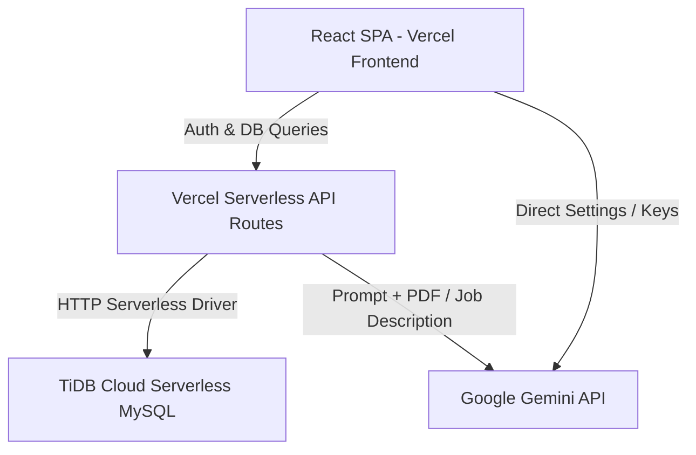

# Technical Architecture Document
## Project: AI Resume Analyzer & ATS Optimizer

### 1. System Overview
The application follows a serverless architecture optimized for Vercel's free tier and TiDB Cloud Serverless database. There is no persistent backend server running; instead, Vercel Serverless Functions execute backend logic dynamically.



---

### 2. Database Schema (MySQL / TiDB)
Since we are using TiDB Cloud Serverless (MySQL-compatible), we will create tables for users, their uploaded resumes, and saved analysis scores.

```sql
-- Users Table
CREATE TABLE users (
    id VARCHAR(36) PRIMARY KEY,
    email VARCHAR(255) UNIQUE NOT NULL,
    password_hash VARCHAR(255) NOT NULL,
    created_at TIMESTAMP DEFAULT CURRENT_TIMESTAMP
);

-- Resumes Table (Stores user resume profiles and details)
CREATE TABLE resumes (
    id VARCHAR(36) PRIMARY KEY,
    user_id VARCHAR(36),
    resume_name VARCHAR(100),
    parsed_json LONGTEXT, -- Stores the JSON representation of the resume details
    pdf_base64 LONGBLOB,   -- Stores the generated ATS-optimized PDF
    updated_at TIMESTAMP DEFAULT CURRENT_TIMESTAMP ON UPDATE CURRENT_TIMESTAMP,
    FOREIGN KEY (user_id) REFERENCES users(id) ON DELETE CASCADE
);

-- Analysis History Table
CREATE TABLE analyses (
    id VARCHAR(36) PRIMARY KEY,
    user_id VARCHAR(36),
    job_title VARCHAR(255),
    job_description TEXT,
    overall_score INT NOT NULL,
    score_breakdown JSON NOT NULL, -- Detailed subscores (keyword, experience, format)
    suggestions JSON NOT NULL,     -- Specific improvement action items
    created_at TIMESTAMP DEFAULT CURRENT_TIMESTAMP,
    FOREIGN KEY (user_id) REFERENCES users(id) ON DELETE CASCADE
);
```

---

### 3. Backend & API Specifications (Vercel Serverless API)

We will use Next.js or Node.js serverless functions under `/api`.

#### API Endpoints:
1. `POST /api/auth/signup` - Register a new user (hashing password using `bcryptjs` and saving to TiDB).
2. `POST /api/auth/login` - Verify user credentials, return JWT token.
3. `POST /api/analyze` - Analyze resume.
   - **Request Payload:**
     ```json
     {
       "pdfBase64": "data:application/pdf;base64,...",
       "jobTitle": "Frontend Engineer",
       "jobDescription": "Looking for React, Tailwind, and TypeScript developer..."
     }
     ```
   - **Handler Logic:**
     - Decode the PDF base64.
     - Send the PDF binary data direct to the Google Gemini API (using inlineData multipart format) along with the Job Description and system grading prompt.
     - Save analysis results to TiDB if the user is authenticated.
   - **Response Payload:** Detailed JSON containing the ATS score, matched/missing keywords, and format warnings.

---

### 4. Gemini API Integration & Prompt Engineering
Instead of running heavy PDF extraction tools locally in Vercel (which can exceed Vercel’s 50MB function size limit), we send the PDF direct to Gemini using the `application/pdf` MIME type.

#### System Prompt Template:
```text
You are an expert technical recruiter and Applicant Tracking System (ATS) evaluator. 
Analyze the provided resume (PDF document) against the target Job Description (JD).
Evaluate the match with 100% precision.

Provide your output strictly in JSON format matching this schema:
{
  "overallScore": 85,
  "breakdown": {
    "keywordScore": 80,
    "experienceScore": 90,
    "formattingScore": 85
  },
  "keywords": {
    "matched": ["React", "Tailwind CSS", "JavaScript"],
    "missing": ["TypeScript", "Next.js", "Docker"]
  },
  "formattingIssues": [
    "Detected multi-column layout. Suggest moving to a clean single-column format."
  ],
  "rewritingSuggestions": [
    {
      "original": "Built some UI pages using React.",
      "suggested": "Engineered 15+ responsive React components, improving load times by 20%.",
      "reason": "Quantify your impact using metrics."
    }
  ]
}
```

---

### 5. Client-Side PDF Generation Strategy
To avoid server-side overhead and rendering timeouts, the PDF is compiled directly in the browser using the `jspdf` library:
- **Style Constraints:** Single-column layout, standard margins (0.75 inch / 54pt), clean font hierarchy (Helvetica or Arial), no graphic dividers, and no icons (which disrupt ATS parsing engines).
- **Hanging Indent Bullet Blocks:**
  Multi-line bullet details are split and drawn with a hanging indent. The bullet character (`•`) is rendered at the left margin, and text blocks are split to size (`contentWidth - 12pt`) and rendered at `margin + 12pt`.
- **Dynamic Text Wrapping & Alignment**:
  - Job titles (roles) and degrees are dynamically measured (`doc.getTextWidth`) and wrapped using `doc.splitTextToSize` so they never overlap right-aligned date ranges.
  - Project technologies are dynamically wrapped and placed either side-by-side or on a separate line based on combined width measurements.
  - Technical skills are rendered with bold labels (e.g. **Languages:**) and adjacent values wrap and align next to them in a clean block.

---

### 6. UX & Interactive Flow Enhancements
- **Radial Score Animation**:
  The Match Score Gauge uses an SVG-based circular progress bar. The outer indicator ring animates on mount using a CSS transition keyframe (`fill-circle`) that translates a percentage value to a `stroke-dashoffset` offset.
- **Staggered Animations**:
  Keywords and checklist results list containers apply scale-in and slide-up animations. Individual elements stagger their transition start times using CSS variables mapping inline `animationDelay` offsets.
- **Custom Modals**:
  Accidental data deletions (e.g., deleting history entries) are intercepted by a themed, glassmorphic custom modal instead of a native browser popup. The modal uses state tracking (`itemToDeleteId`) and backdrop blur to focus the confirmation action.
- **Guest Promotion Card**:
  Conditionally displayed on the dashboard when `!token` is active. Highlights key signup value propositions and provides a direct route to the registration screen.
